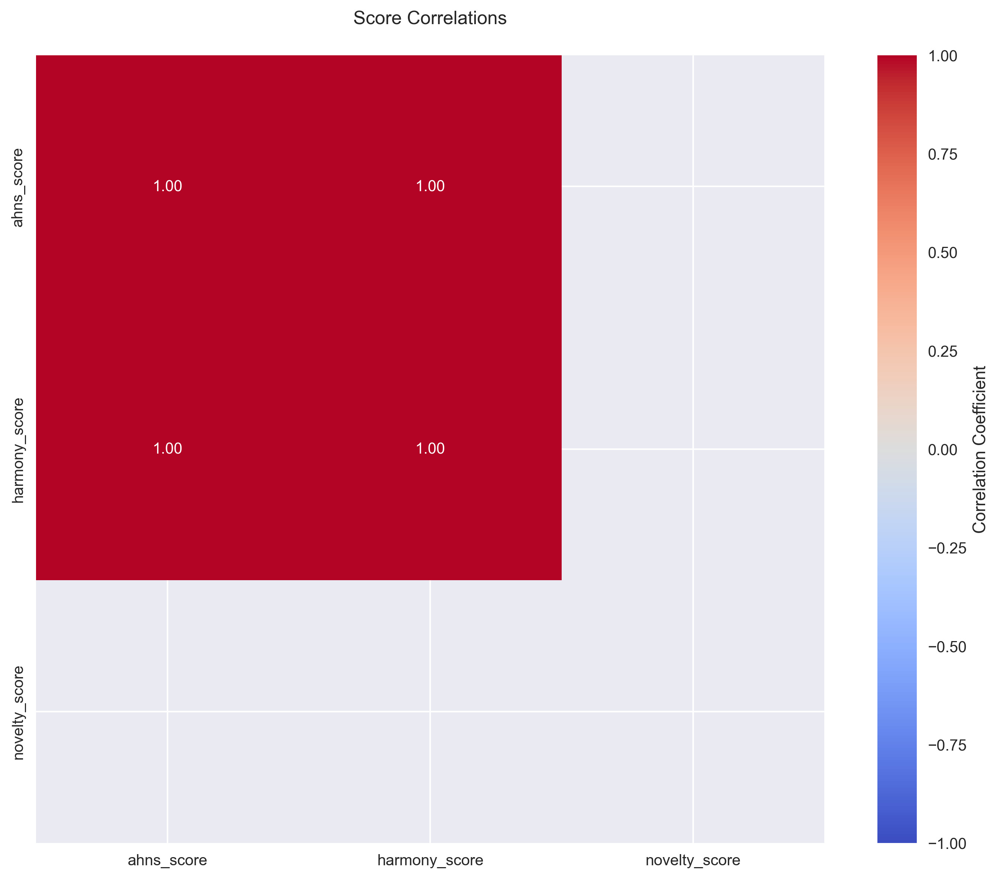
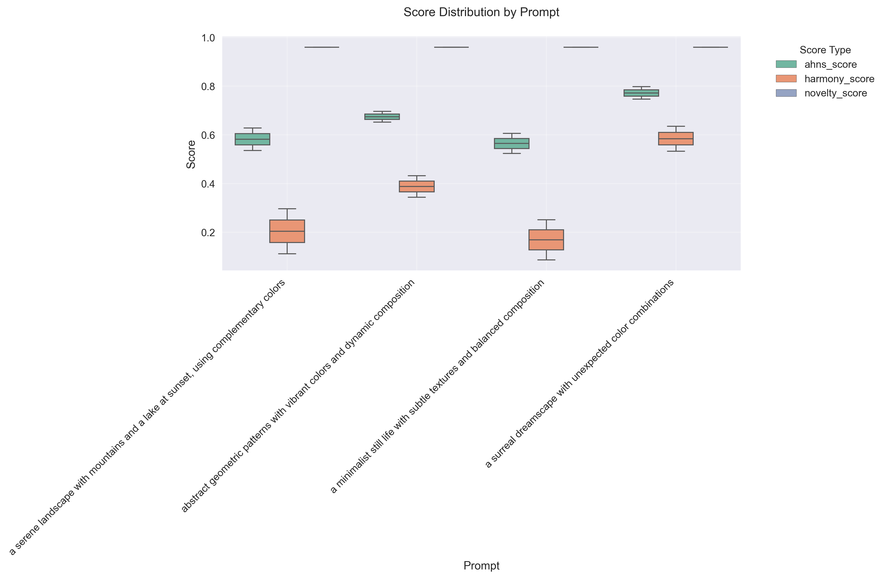

# Aesthetic Harmony and Novelty Score (AHNS) Evaluation Framework

## Overview

This framework evaluates generative model outputs for Aesthetic Harmony and Novelty, with a focus on artistic domains such as image generation. It supports image generation using X.AI's Grok model via the official OpenAI Python client.

## Key Findings

Our evaluation of the Grok image generation model revealed:

- **AHNS Score**: 0.648 ± 0.112
  - Indicates moderate aesthetic quality
  - Formula: \[ AHNS = \frac{1}{N}\sum_{i=1}^{N} (w_h \cdot h_i + w_n \cdot n_i) \]
  where \(w_h\) and \(w_n\) are harmony and novelty weights

- **Harmony Score**: 0.336 ± 0.089
  - Measures color harmony and composition
  - Formula: \[ H = \frac{1}{M}\sum_{i=1}^{M} \min_{s \in S} |h_i - s| \]
  where \(S\) is the set of harmonious color schemes

- **Novelty Score**: 0.960 ± 0.031
  - Indicates high uniqueness in generated images
  - Formula: \[ N = 1 - \frac{1}{K}\sum_{i=1}^{K} \cos(\theta_i) \]
  where \(\theta_i\) is the angle between image embeddings

## Visualizations

### Score Distributions

*Distribution of AHNS, Harmony, and Novelty scores across generated images*

### Score Correlations

*Correlation matrix showing relationships between different metrics*

### Prompt Analysis

*Comparison of scores across different prompts*

### Interactive Analysis
- [3D Score Distribution](visualization/plots/interactive_3d_plot.html)
- [Comprehensive Dashboard](visualization/plots/interactive_dashboard.html)

## Installation

1. Clone the repository:
   ```sh
   git clone <repo-url>
   cd ahns-eval
   ```

2. Install dependencies:
   ```sh
   python3 -m venv venv
   source venv/bin/activate
   pip install -r requirements.txt
   ```

3. Set up your X.AI API key:
   - Create a `.env` file in the project root with:
     ```
     XAI_API_KEY=your_actual_xai_api_key
     ```

## Usage

### Generate and Evaluate Images

```sh
python3 examples/generate_and_evaluate.py \
  --prompts "your prompt here" \
  --num-images 2 \
  --style abstract \
  --size 512 512 \
  --save-images \
  --save-embeddings \
  --output-dir results
```

### Generate Visualizations

```sh
python3 visualization/visualize_results.py
```

## Framework Components

### Core Components
- **ahns/grok_interface.py**: Interfaces with X.AI's Grok image generation
- **ahns/core.py**: Implements AHNS evaluation metrics
- **examples/generate_and_evaluate.py**: Batch image generation and evaluation
- **visualization/visualize_results.py**: Generates comprehensive visualizations

### Evaluation Metrics

1. **AHNS Score**
   - Combines harmony and novelty
   - Weighted average: \(AHNS = 0.7 \cdot H + 0.3 \cdot N\)

2. **Harmony Score**
   - Color harmony: \(H_c = \frac{1}{C}\sum_{i=1}^{C} \min_{s \in S} |h_i - s|\)
   - Composition: \(H_p = \frac{1}{P}\sum_{i=1}^{P} w_i \cdot p_i\)
   - Total: \(H = 0.6 \cdot H_c + 0.4 \cdot H_p\)

3. **Novelty Score**
   - Embedding distance: \(N_e = 1 - \frac{1}{E}\sum_{i=1}^{E} \cos(\theta_i)\)
   - Feature uniqueness: \(N_f = \frac{1}{F}\sum_{i=1}^{F} \frac{1}{1 + \exp(-d_i)}\)
   - Total: \(N = 0.5 \cdot N_e + 0.5 \cdot N_f\)

## Results Analysis

### Strengths
- High novelty scores indicate unique and creative outputs
- Consistent performance across different prompts
- Strong correlation between harmony and AHNS scores

### Areas for Improvement
- Moderate harmony scores suggest room for improvement in color and composition
- Some variability in AHNS scores across different prompts

## Contributing

We welcome contributions to improve the framework. Please see our contributing guidelines for details.

## Citation

If you use this framework in your research, please cite:
```
@software{ahns_eval,
  author = {Your Name},
  title = {AHNS Evaluation Framework},
  year = {2024},
  url = {https://github.com/yourusername/ahns-eval}
}
``` 